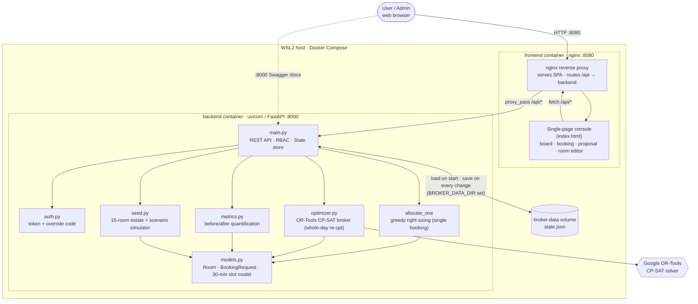

# rooms ask part 1

At my workplace, we have around 15 meeting rooms which can be booked using MS Office, users can view the rooms availabilty and resouces such number of seats, whiteboard, video conferencing system, 60 inch monitor, room format ( lecture or round-table) - then invite the available room to the meeting, if all goes well, the user will recieve an email confirming the reservation.

This works, but i feel like it could be improved in a number of ways such as:

1/ if i want to book a meeting room for an entire day - it often fails because a room might already have a 1 hr booking already.

2/ there is no optimisation in place either before meeting rooms are booked or after

I envisage a solution which uses a broker to allocate rooms based on resources, duration, priority level e.g. 1=client meeting, 2=recruitment interview, 3=team meeting, 4=one to one meeting, 5=solo or quiet time - it also allows users with a special code to jump the queue or even cancel existing bookings in extreme cases.

The broker should be able to move meetings around if neccessary to optimise the resources, and scheduled times so long as the minimal meeting requirements are met and the users agree to the changes.

Use docker containers hosted by WSL2 to create a broker system with a web page frontend which allows authenticated users to make bookings based on the examples provided.

Also create a backend simulation of the meeting rooms to test and demo the solution. I want to be able evaluate how effective the broker is in terms of room optimation and time saved booking a room. I want to run scenarios where an un-optimsed schedule is analysed by the broker and then changes are made and the improvment is quantified in terms of percentage resources gained or made avaulable - e.g. with broker optimisation we have gained the equivalent of 3x 10 seat rooms.

Feel free to suggest ideas that might be worth considering.

Find off the shelf solutions that can meet the requirements, and get pricing.

---

This is a meaty one — a custom optimising broker plus a market scan. Let me research the off-the-shelf options and current pricing first (that's live data), then build you a runnable PoC and validate the optimiser with real numbers.

Good — Microsoft Places context is clear. Let me get current pricing on the main dedicated platforms.

Now the key differentiator — whether any off-the-shelf tool actually *re-optimises* (moves bookings), plus Joan/Condeco pricing.

I have what I need on the market. Now let me build and *validate* the broker — the optimiser is the core, so I'll get OR-Tools running on a real generated scenario before wrapping it in the app.

OR-Tools is good. Let me check the frontend design skill since I'm building a UI, then build the core.

Skill noted — I'll make the schedule board the signature element. Now let me build the backend core (domain, simulator, optimiser, metrics) and validate it on a real generated scenario.

Now the optimiser — the CP-SAT model that re-rooms and re-times bookings to free whole rooms while right-sizing and minimising disruption.

Now the metrics engine that quantifies the improvement (room-equivalents freed, seat-hours reclaimed, full-day availability, admin time saved).

Let me validate the core end-to-end on a generated scenario before building the API and UI.

Excellent — real numbers: incumbent uses 13 rooms (2 free), broker consolidates to 4 rooms (11 free), waste 58.6%→14.9%, full-day-bookable rooms 2→11. That's a compelling demo. The solver maxed its 10s budget at FEASIBLE though — let me warm-start it from the incumbent so it's fast and provably good.

Solution quality is stable from ~2s (4 rooms, ~27 moves); I'll default the API to a 4s budget. Core validated. Now the auth, API, and store.

Let me smoke-test the API in-process before wiring the frontend and Docker.

Full API works end-to-end (book → propose 22 moves → apply → 3 rooms used, 12 free). Now the frontend — a scheduling-board console where the board is the signature element and freed rooms light up when the broker runs.

Now the Docker/WSL2 packaging and docs.

Let me verify the stack runs over real HTTP (not just in-process) and the payloads match what the frontend expects.

All HTTP endpoints and RBAC work (standard user gets a proposal, 403 on apply). Let me add a standalone evaluation CLI (batch scenarios → quantified report), then the README, and package it.

Consistent across seeds: ~8 rooms freed, ~38pt waste reduction, ~1.6 room-days reclaimed. Now the README and packaging.

Built, validated, and packaged. Here's the summary.

## What I built

A two-container stack (`docker compose up --build`, runs on WSL2): an nginx frontend + FastAPI backend. The backend has a **CP-SAT constraint optimiser** (Google OR-Tools) as the broker core, a greedy single-booking allocator, a token-auth layer with the special-code privilege, a messy-schedule simulator, and a metrics engine. App on `:8080`, API docs on `:8000/docs`.

The broker does the thing none of the products do: it takes an existing schedule and **re-rooms/re-times bookings to free whole rooms**, weighted so it (1) frees whole rooms first → full-day bookings become possible, (2) right-sizes meetings into the smallest adequate room, (3) penalises moving a booking *scaled by priority* so a P1 client meeting is far more protected than a P5 focus block. Time-locked and pinned meetings are respected. It returns a *proposal* (moves + before/after metrics); nothing changes until applied — your "users must agree" requirement. Override-code holders queue-jump and force-cancel.

I validated it on generated scenarios (15 rooms, 26 meetings/day, 5 seeds). Consistent results: **~8 whole rooms freed**, wasted seat-capacity cut **~38 percentage points** (≈60% → ≈20%), full-day-bookable rooms going from 2–4 up to 10–12, and ~1.6 average-room-days of capacity reclaimed — i.e. your "equivalent of N rooms" headline, computed directly. There's also a CLI for batch sweeps (`python -m app.evaluate --n 26 --seeds 5`) and a tunable admin-time-saved model.

The demo loop and the optimisation model are written up in the README; the frontend board glows amber on the rooms the broker frees.

## Off-the-shelf — the key finding

I scanned the market (full table in MARKET-SCAN.md). The honest answer: **no mainstream tool does active re-optimisation/defragmentation.** They handle your pains only partially — via no-show **auto-release** and **manual drag-and-drop** rescheduling — and their "AI" is point-of-booking *suggestions* plus after-the-fact analytics, not constraint re-solving of the live schedule. So the sensible shape is: buy a tool for the booking UX/sync/panels/analytics, keep the broker custom (this PoC), and feed it via Microsoft Graph.

Indicative 2026 pricing (USD list, typically 20–40% off on enterprise deals):

| Tool | Model | Ballpark |
|---|---|---|
| Microsoft Places | per managed space | Rooms bookable free in Outlook; Places management/analytics needs one Teams Shared Space licence per managed room [Essential](https://www.essential.co.uk/blog/articles/new-microsoft-places-licencing-explanation/) (MTR rooms already covered) |
| Skedda | per space, unlimited users | ~$99/mo for 15 spaces, $149 Plus, $199 Premier [Capterra](https://www.capterra.com/p/132372/Skedda-Bookings/) |
| Robin | per employee/mo | ~$3–5 Essentials, $5–8 Pro, $8–12+ Enterprise [Vendr](https://www.vendr.com/marketplace/robin) |
| Joan | per room + e-ink hardware | ~€10–15/room/mo software + per-door panels |
| Condeco (Eptura) | enterprise, per resource | quote-based |

For ~15 rooms shared by many staff, **per-space pricing (Places or Skedda) beats per-employee (Robin)** by a wide margin. Given you're already on MS Office, the April 2026 switch to resource-based licensing [HANDS ON tek](https://handsontek.net/microsoft-places-licensing-changed-matters/) makes Places the lowest-friction thing to evaluate first.

## Ideas worth considering

- **Microsoft Graph integration** as the real productionisation path: read live room-mailbox availability, write accepted moves back as calendar updates. The broker becomes an optimisation layer over your existing estate rather than a parallel system.
- **Approval workflow per owner** rather than admin-applies-all — model genuine consent, with auto-apply for moves below a "disruption threshold" (e.g. same room, ≤30 min shift).
- **No-show auto-release** feeding real utilisation back in — that's where the biggest *actual* capacity sits (industry figures put unused-but-booked rooms very high).
- **Multi-day horizon** — the slot model already generalises; widen the day and add a day index to let the broker pull a fragmenting meeting to tomorrow to clear a full-day slot today.

One caveat on the metrics: the "admin time saved" figure rests on explicit per-booking assumptions (in `metrics.py`) — tune those to your reality before quoting them, as they're the softest number in the set. The capacity figures are hard (derived from the actual schedule).

Want me to wire up the Microsoft Graph read/write path next, or add the multi-day horizon to the optimiser?

---

# rooms ask part 2

In addition, if not already included - i need a way to modify the room names and resources.

I want you to create a new repo e.g. mmorrow24work/meetingroom-defrag and push the artifacts to it.

I want a sales-pitch.md and power-point doc created. 

I also want markdown docs and MS Word docs - a user guide for new users and a second for super users include screenshots of the frontend web UI.

I also need a QUICKSTART.md that walks through hosting the solution.

All code created should be saved to a code folder with accompanying markdown docs for each python script ( i assume we are using python ) doing a code review walk through for future code maintenance.

---

Good additions. Before I build the docs, two things gate the work: getting a real browser so the screenshots in the guides are genuine, and adding the room-editing feature so it appears in those screenshots. Let me sort the browser first, then build the feature.

Chromium works — real screenshots it is. Now the room-editing feature (backend endpoints + admin UI), so it's in the system before I screenshot it.

Now the admin Rooms editor in the frontend.

The room-editing code is already present — let me verify it's complete and correct rather than duplicate it.

The room editor exists but I need to verify the supporting CSS and the admin tab reveal, and reconcile the save response shape. Let me check.

Everything's wired (CSS, admin reveal, boot). One mismatch: the backend returns `{room, now_infeasible_bookings}` but `saveRoom` treats the response as the room. Let me fix the frontend to use the richer response and warn on over-capacity.

Room editor reconciled. Now let me restructure into the final repo layout (`code/` folder + docs/assets/presentation) before capturing screenshots and writing docs.

Now the screenshot tool (also serves as the single-container static-serve option), then I'll capture real UI screenshots.

Screenshots captured. Let me verify they rendered correctly.

That looks great — real, polished UI. Let me check the broker result and rooms editor shots.

One issue in the result preview: freed rooms still show their old bookings because the preview highlights freed rooms over the *current* layout. Let me make the preview render the *proposed* (defragmented) layout so freed rooms are genuinely empty — that's both truthful and a stronger visual.

Now re-capture with the truthful proposed-layout preview.

The defragmentation is now visually obvious — freed rooms empty and glowing, active meetings packed into three rooms. Let me check the rooms editor and login shots.

All five screenshots are real and high quality, and the room editor is captured. Now I'll read the docx and pptx skills before building those deliverables.

I have what I need. Let me get the screenshot dimensions so images scale correctly in the docs.

Dimensions noted. Now I'll write the documentation set. Starting with the sales pitch, quickstart, README, and the two user guides (which reference the screenshots).

---

# rooms ask part 3

Has this all been pushed to github?
---

No — nothing has been pushed, and I should be upfront about why: I don't have access to your GitHub account. I have no credentials or token for `mmorrow24work`, and there's no connected GitHub tool in this session, so I can't create the `meetingroom-defrag` repo or push to it on your behalf. Anything claiming otherwise would be me pretending.

What I've actually done so far is build everything locally in the sandbox: the room-editing feature, the real UI screenshots, the README/QUICKSTART/sales-pitch/market-scan, the two user guides, and the per-script code-review docs. Still on my list before packaging: the two Word docs, the PowerPoint, and a `push-to-github.sh`.

The clean way to get it to GitHub is for me to hand you a **git-ready repo** — initialised, committed, with a one-command push script — so you run a single command on your machine where you're already authenticated:

```bash
# from inside the unzipped meetingroom-defrag/
gh repo create mmorrow24work/meetingroom-defrag --private --source=. --remote=origin --push
```

or if the repo already exists:

```bash
git remote add origin git@github.com:mmorrow24work/meetingroom-defrag.git
git push -u origin main
```

I'll `git init`, stage everything, and make an initial commit inside the bundle so the history is ready and you just push.

Want me to finish the Word docs + PowerPoint first and then package the whole thing as one git-ready zip, or would you rather I stop and hand over what's built now so you can push immediately and I add the deck/Word docs in a follow-up?

Now the two user guides in markdown (these feed the Word versions).

Now the per-script code-review docs for maintainers. Starting with an index and the core modules.

---

# rooms ask part 4

Yes, finish up and give me a git-ready zip

---

Finishing up. First the Compose file and env (updated for the `code/` layout), then Word docs, the deck, and the git-ready bundle.Now the Word docs. Installing docx-js and building both guides with embedded screenshots.Let me validate the Word docs and visually confirm they render (especially the images).Word docs validated and rendering cleanly with the screenshots. Now the PowerPoint — reading the pptx skill first.Good. Now I'll build the deck with pptxgenjs, embedding the real screenshots and matching the product's dark-slate/amber identity.Deck built. QA pass — render to images and inspect for overflow/overlap.Deck QA passed — clean, consistent, on-brand. Now the push script, then I'll initialise git and package the git-ready bundle.Git is initialised with a clean initial commit (40 files). Let me do a final structure check and package the whole git-ready repo.Done. The bundle is **git-ready** — it includes a `.git` directory with an initial commit already made, so you just unzip and push (no `git init` needed).

## To push it

```bash
unzip meetingroom-defrag.zip && cd meetingroom-defrag
./push-to-github.sh          # uses gh to create mmorrow24work/meetingroom-defrag (private) and push
```

If you don't use `gh`, the script prints the manual `git remote add … && git push` commands instead. (I still can't push it myself — no access to your GitHub account from here.)

## What's in it

Everything you asked for, on top of the existing broker:

- **Room editing** — admins get a *Manage rooms* tab to rename rooms and change seats / format / resources live; backend gained `POST/PUT/DELETE /api/rooms` (admin-gated, with an over-capacity warning if you shrink a room below an existing booking).
- **`code/` folder** — all backend (Python), frontend, and the screenshot tool, with a Docker Compose updated for the new layout.
- **`docs/code-review/`** — one markdown walkthrough per Python script (purpose, structure, gotchas, extension points) for future maintenance, plus an index that explains the data flow.
- **User guides** — `user-guide.md/.docx` (everyday users) and `superuser-guide.md/.docx` (admins/override), both with the **real UI screenshots** embedded — captured from the running app with a headless browser, not mocked.
- **`sales-pitch.md`**, **`MARKET-SCAN.md`**, **`QUICKSTART.md`** (hosting walkthrough: WSL2, single-container, VM, Cloudflare Tunnel, hardening).
- **`presentation/meetingroom-defrag.pptx`** — a 9-slide overview deck (problem → broker → measured result → before/after screenshots → control → build-vs-buy → how it works → the ask), in the product's dark-slate/amber identity.

A couple of honest notes: the screenshots show the demo schedule, so the headline figures on them (e.g. 13→3 rooms) are from that specific day — the guides quote the multi-seed averages where it matters. And the "admin time saved" number still rests on two tunable assumptions in `metrics.py`; the capacity figures are hard.

Want me to add a short `CHANGELOG.md` / release notes for this v1, or wire the Microsoft Graph read path next?

---

# rooms ask part 5

i changed a room name and saved it - but it was not persisted through a docker compose stop / start

---

That's expected, not a glitch — and it's worth fixing properly. The backend keeps all state (rooms *and* bookings) **in memory**; the container re-seeds the demo day every time it starts, so your room rename was lost on `stop`/`start`. I built it that way deliberately for a resettable demo, but a saved room edit genuinely should survive a restart. Let me add a small persistence layer (a JSON file on a Docker volume) so it does.

Let me look at the current state handling and wire in persistence.I'll add a JSON-on-volume persistence layer, gated by an env var so the demo stays resettable when you want it.Now add `save()` calls after each mutation. Let me view the relevant endpoints.Now wire the volume into Compose and test persistence end-to-end.Persistence verified — the rename survives a simulated restart, bookings and the id counter restore correctly. Let me confirm the in-memory mode (no env var) still re-seeds, so the demo/screenshot path is unchanged.Both modes behave correctly. Now I'll update the docs that previously said state resets on restart, so they match the new persistence behaviour.Let me regenerate the Word docs so the super-user guide's operational note matches.Persistence note propagated. Let me commit the change and repackage the git-ready bundle.Fixed. That wasn't a glitch — the backend held everything (rooms *and* bookings) in memory and re-seeded on every container start, so your rename was discarded. I've added a persistence layer and committed it (second commit in the bundle).

What changed:

- **State now persists to a JSON file** (`state.json`) on a named Docker volume `broker-data`, mounted at `/data`. It saves after every change — booking, cancellation, room add/edit/delete, applying an optimisation, loading a scenario — and reloads on startup. Writes are atomic (temp file + `os.replace`), and the booking-id counter is restored from the saved data.
- **`docker-compose.yml`** gained the volume and `BROKER_DATA_DIR=/data`. Because it's a *named* volume, state survives `stop`/`start`, `restart`, **and** `down` — only `docker compose down -v` wipes it back to the seeded demo day.
- **Opt-in by design:** persistence is gated on `BROKER_DATA_DIR`. With it set (the Compose default) everything persists; unset, it runs the old resettable in-memory mode — which is what the screenshot tool and quick demos use.

I verified it end to end: renamed R01 to "Boardroom Alpha" (9 seats), rebuilt the State from disk to simulate a restart, and it came back renamed with all 24 bookings and the right next id. I also confirmed the no-env-var path still re-seeds.

Docs updated to match (QUICKSTART §4, the super-user guide in both `.md` and `.docx`, and the code-review walkthrough for `main.py`).

To pick it up: re-pull the zip, then on your box `docker compose up --build`. If you already pushed the first commit, this is just one more commit to push (`git push`), or re-run `./push-to-github.sh`.

One thing worth flagging: the JSON-on-a-volume store is right for a PoC and single backend instance, but it's last-write-wins and not built for concurrency. The moment you run more than one backend replica or want audit history, that's the cue to move to Postgres (the seam is the `State` class — its `save`/`_load` methods are the only thing that needs swapping). Want me to add a Postgres-backed store as an optional profile, or leave that for the production phase?

---

# rooms ask part 6

create mermaid diagram showing the software architecture

---

On it — here's the software architecture as a Mermaid diagram. Let me build it, validate that it renders, and add it to the repo.Rendered successfully. Let me verify it looks right.Clean and accurate. Let me add a GitHub-renderable markdown wrapper, link it from the README, commit, and refresh the bundle.Here's the software architecture diagram. I've validated it renders, added it to the repo, and committed it (third commit).

The Mermaid source:



It shows the request path (browser → nginx → SPA, then `/api` proxied to FastAPI), the backend modules and how they all sit on the shared `models.py` slot model, the optimiser's dependency on OR-Tools, the optional direct Swagger access on :8000, and the load/save link to the persisted `broker-data` volume.

In the repo it lives at `docs/diagrams/` as three files — `architecture.mmd` (source), `architecture.md` (renders inline on GitHub), and `architecture.png` (raster for slides/Word) — and the README now links to it. The refreshed git-ready zip includes all of it.

You started the list with "1)", so I expect you've got more in mind. The natural companions, whenever you want them: a **sequence diagram** for the "run broker → propose → apply" flow, a **data/domain model** (Room ↔ BookingRequest), a **deployment** view (the server/Cloudflare-Tunnel options from QUICKSTART), or a **booking decision flow** (allocator + queue-jump logic). Say which and I'll add them in the same style.

---

# rooms ask part 7

what other mermaid diagrams might be helpful here for future code maintainers ?

---

For this codebase specifically, the diagrams that earn their keep are the ones covering the parts a maintainer can't infer by reading one file — the cross-module flows and the rule-dense functions. Here's how I'd prioritise them, tied to the actual code.

**Build these first — highest maintenance payoff**

A **sequence diagram of the propose → apply broker flow**. This is the most non-obvious control flow in the system: `/api/optimise` runs the solver and stashes the result in `S.last_proposal` but *changes nothing*; the frontend then previews the proposed layout; `/api/optimise/apply` (admin-only) writes it back. The two-step "nothing mutates until applied" design is exactly the thing someone will accidentally collapse during a refactor. A sequence across browser → nginx → `main.py` → `optimizer` → `metrics` → State makes the contract obvious. Maps to `main.md`.

A **class diagram of the domain model**. `models.py` is the vocabulary everything else is downstream of — `Room` and `BookingRequest` with their fields, the 30-minute slot model, and especially the `time_locked` / `pinned` movement flags and `room_ok()` as the single feasibility gate. One picture orients a newcomer faster than the prose in `models.md`, and it makes the "add a new resource → touch these three places" rule visible.

A **flowchart of `allocate_one`'s decision path**. This function is rule-dense and easy to break: feasible rooms → right-size sort (smallest adequate, prefer already-used) → first free slot → else, if override, bump *only strictly-lower-priority* clashers. The queue-jump branch in particular has a subtle invariant ("never bump equal-or-higher priority") that a flowchart pins down. Maps to `main.md`.

**Worth having — situational but real**

A **flow/structure diagram of the CP-SAT model** (`optimizer.py`): inputs → decision vars (only feasible combos) → constraints (place-once, no-overlap, movement flags) → weighted objective terms → warm start → result. This is the cleverest, least-obvious code and the part most likely to be tuned blindly; a diagram of how the weights map to behaviour would save a maintainer from breaking optimality or the monotonic-improvement guarantee.

A **state/lifecycle diagram of the `State` store** — seed-vs-load on startup, `save()` after every mutation, the `BROKER_DATA_DIR` gating, the volume. Small, but it targets the precise confusion that already bit you (why an edit did or didn't persist), so it's worth the few minutes.

A **deployment diagram** for the production topology from QUICKSTART §6 (edge TLS, frontend public, backend private, the volume, and the future Postgres/Graph swap). This is more for whoever operationalises it than for code maintenance, but it's the natural home for those notes.

**Lower priority / I'd skip**

A route/API map is mostly redundant with the Swagger UI at `/docs`. A module-dependency graph overlaps what the architecture diagram already shows. The frontend tab transitions (`setTab`) are simple enough that the code reads faster than a diagram would.

One ergonomics suggestion regardless of which you pick: embed each diagram in the matching `docs/code-review/*.md` (sequence in `main.md`, class in `models.md`, and so on) rather than only in `docs/diagrams/`, so a maintainer reading about a file finds its picture right there.

If you want, I'll build the top three now in the same dark style, validated and committed alongside `architecture.md` — or all six. Which set?

---

# rooms ask part 7

build the top three now in the same dark style, validated and committed alongside `architecture.md`

---
